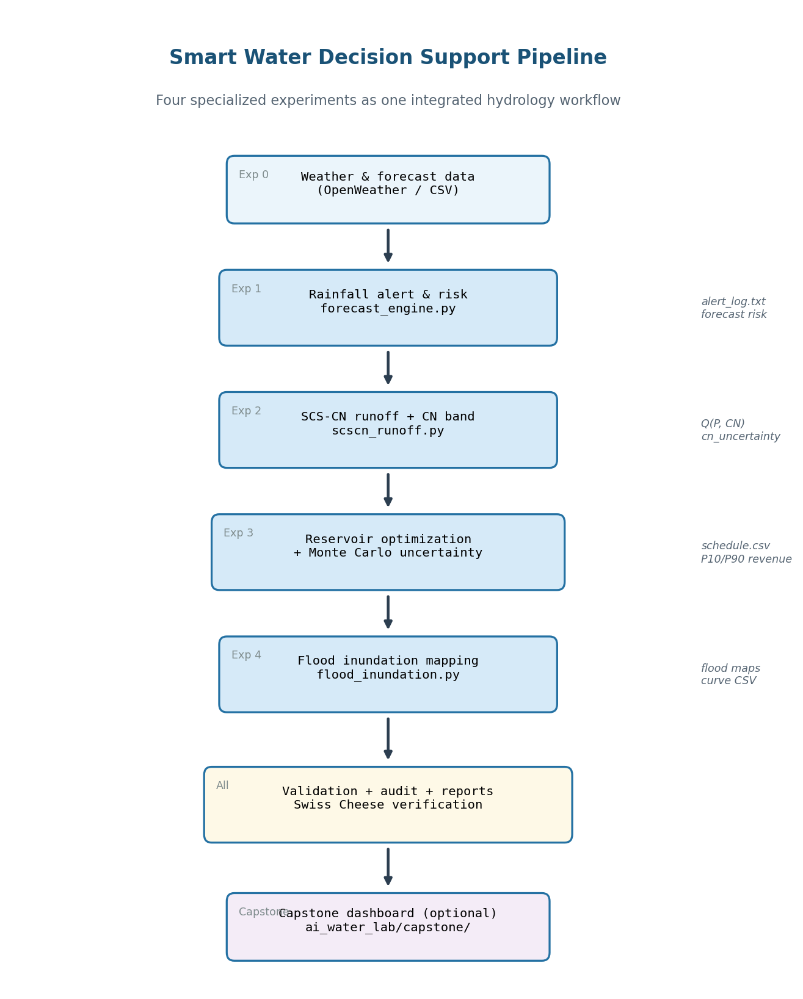
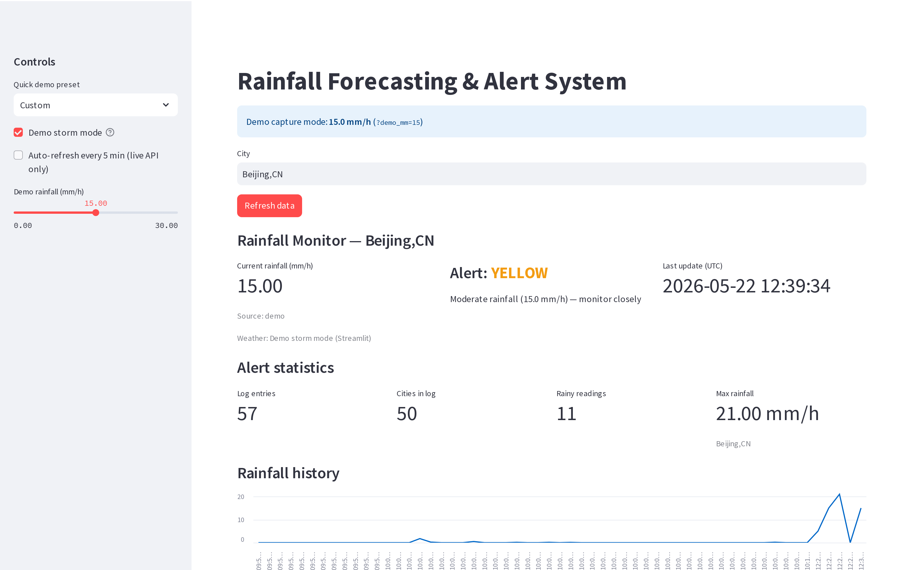
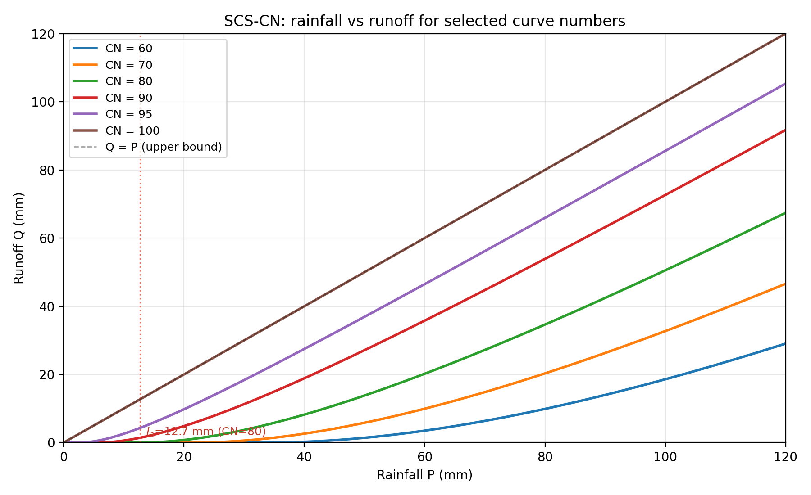
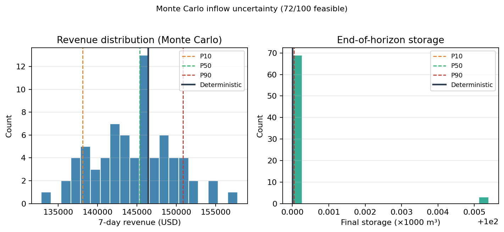
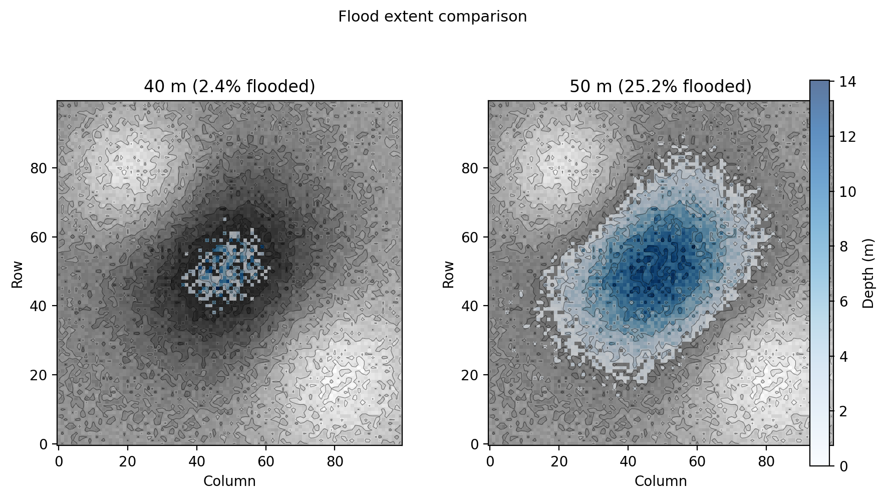

<p align="center">
  
</p>

# Smart Water Lab

### AI-Augmented Water Resources Decision Support Platform

Integrated rainfall monitoring, runoff modeling, reservoir optimization, and flood-risk analysis with documented AI-assisted software engineering practices.

**Mahmudul Hasan (4125999049)** · Xi'an Jiaotong University · 2026


---

## Platform gallery

| Rainfall monitoring | Runoff modeling |
|:--:|:--:|
|  |  |
| Exp 1 — API, GREEN/YELLOW/RED, 3h/6h forecast | Exp 2 — hand-validated Q=13.80 mm at P=50, CN=80 |

| Reservoir optimization | Flood analysis |
|:--:|:--:|
|  |  |
| Exp 3 — trust-constr, eco trade-off, P10/P50/P90 | Exp 4 — DEM inundation, 9/9 validation PASS |

---

## Key metrics

| Metric | Value |
|--------|------:|
| Specialized experiments | 4 |
| PDF reports + case study | **5** |
| Weekly lab reports | **16** |
| Automated tests | **88** |
| Validation CLI scripts | 4 |
| AI outputs reviewed / corrected | 52 / **9** |
| Monte Carlo inflow scenarios | 100 |

---

## Key deliverables

| | Document | Download |
|--|----------|----------|
| 📘 | **AI Engineering Portfolio** — pipeline, AI statistics, threats to validity | [PDF](submission/portfolio/AI_Engineering_Portfolio.pdf) |
| 📄 | **Experiment 1** — Rainfall monitoring & alerting | [PDF](submission/experiment_reports/Experiment1_Rainfall_Alert/Experiment1_Rainfall_Alert_Report.pdf) |
| 📄 | **Experiment 2** — SCS-CN runoff modeling | [PDF](submission/experiment_reports/Experiment2_SCSCN_Runoff/Experiment2_SCSCN_Runoff_Report.pdf) |
| 📄 | **Experiment 3** — Reservoir dispatch optimization | [PDF](submission/experiment_reports/Experiment3_Reservoir_Optimization/Experiment3_Reservoir_Optimization_Report.pdf) |
| 📄 | **Experiment 4** — Flood inundation analysis | [PDF](submission/experiment_reports/Experiment4_Flood_Inundation/Experiment4_Flood_Inundation_Report.pdf) |

**Release bundle:** [v1.0 — Smart Water Lab Submission](https://github.com/mahmud456alhasan-debug/smart-water-capstone/releases/tag/v1.0.0) · short filenames in [`release/`](release/) · LaTeX sources in [`submission/`](submission/)

**Weekly lab reports (16):** [lab_reports/README.md](lab_reports/README.md) — Weeks 1–8, PDF + LaTeX + appendix code

---

## Quick start

```bash
git clone https://github.com/mahmud456alhasan-debug/smart-water-capstone.git
cd smart-water-capstone
python3 -m pip install -r requirements.txt
streamlit run app/main.py
pytest -q
```

Copy `dem.npy` into `data/` for the flood tab (from Week 6 lab or local Experiment 4 output).

---

## Repository structure

```text
smart-water-capstone/
├── assets/           Showcase figures (pipeline, dashboards)
├── release/          PDFs for GitHub Releases
├── submission/       Experiment packages (PDF + LaTeX + figures)
├── lab_reports/      Weekly course labs (16 PDFs, appendix code)
├── docs/             Engineering details, wiki, GitHub setup
├── app/              Streamlit capstone dashboard
├── src/              weather · runoff · reservoir · flood modules
└── tests/            Capstone pytest suite (88 tests)
```

Experiment source code: local `ai_water_lab/experiment*` folders (not duplicated in this repo).

---

## Further documentation

| Resource | Purpose |
|----------|---------|
| [docs/ENGINEERING.md](docs/ENGINEERING.md) | Validation, AI engineering, maturity assessment |
| [lab_reports/README.md](lab_reports/README.md) | Weekly lab index with gallery and appendix folders |
| [submission/README.md](submission/README.md) | Regenerate experiment PDFs and figures |
| [docs/GITHUB_SETUP.md](docs/GITHUB_SETUP.md) | About section, topics, Release v1.0 |
| [docs/wiki/](docs/wiki/) | Wiki pages — copy to GitHub Wiki |
| [ARCHITECTURE.md](ARCHITECTURE.md) | Capstone system design |
| [AGENTS.md](AGENTS.md) | AI collaboration protocol |

---

## License

Academic coursework — Xi'an Jiaotong University, 2026.
