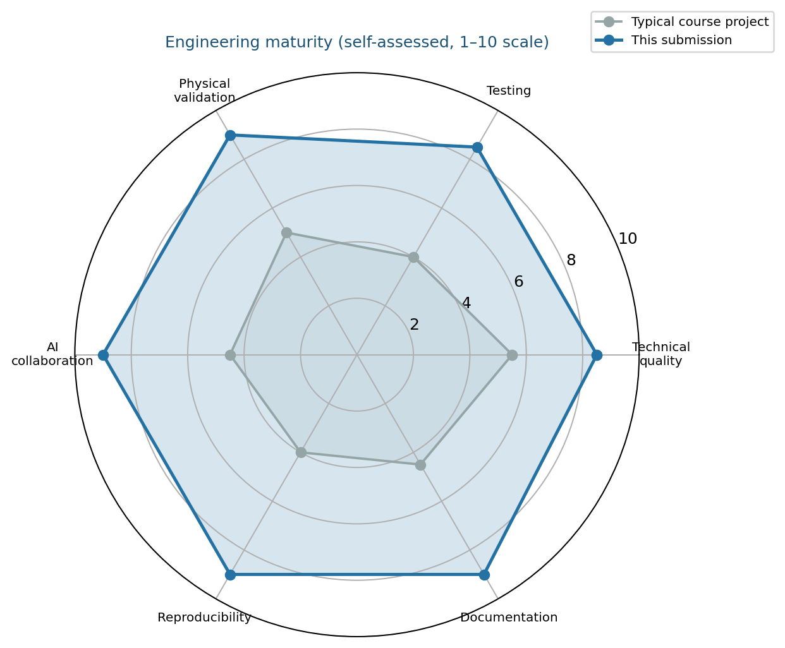

# Smart Water Lab

### AI-Augmented Water Resources Decision Support Platform


**Mahmudul Hasan** · 4125999049 · Xi'an Jiaotong University · 2026  
*AI-Augmented Software Engineering — complete hydrology suite with formal reports and documented verification*

---

## What this repository is

One integrated engineering platform—not a single homework script:

| Module | Capability |
|--------|------------|
| Rainfall monitoring | Live API + 3h/6h forecast risk classification |
| Runoff modeling | USDA SCS-CN + CN uncertainty band |
| Reservoir optimization | 7-day dispatch + Monte Carlo P10/P50/P90 |
| Flood analysis | DEM inundation, stage curves, 9/9 validation |
| Capstone dashboard | Streamlit integration of all four domains |
| AI case study | Swiss Cheese verification + Jagged Frontier evidence |

---

## Submission package (start here)

| Document | Description | Download |
|----------|-------------|----------|
| AI Engineering Case Study | Integrated pipeline, AI stats, validity threats | [PDF](submission/portfolio/AI_Engineering_Portfolio.pdf) |
| Experiment 1 | Rainfall monitoring & alerting | [PDF](submission/experiment_reports/Experiment1_Rainfall_Alert/Experiment1_Rainfall_Alert_Report.pdf) |
| Experiment 2 | SCS-CN runoff modeling | [PDF](submission/experiment_reports/Experiment2_SCSCN_Runoff/Experiment2_SCSCN_Runoff_Report.pdf) |
| Experiment 3 | Reservoir dispatch optimization | [PDF](submission/experiment_reports/Experiment3_Reservoir_Optimization/Experiment3_Reservoir_Optimization_Report.pdf) |
| Experiment 4 | Flood inundation analysis | [PDF](submission/experiment_reports/Experiment4_Flood_Inundation/Experiment4_Flood_Inundation_Report.pdf) |

LaTeX sources and appendix code: [`submission/`](submission/)

---

## Key metrics

| Metric | Value |
|--------|------:|
| Specialized experiments | 4 |
| PDF reports + case study | **5** |
| Automated tests (Exp 1–4) | **88** |
| Validation CLI scripts | 4 |
| AI outputs reviewed / corrected | 52 / **9** |
| Monte Carlo inflow scenarios | 100 |
| Python modules (core experiments) | ~40 |
| Reproducibility scorecards | 4 |

---

## Integrated system architecture


Weather and forecast data flow through monitoring → runoff → reservoir operations → flood impact assessment, with validation and LaTeX evidence at each stage.

---

## Engineering maturity



Self-assessed comparison: typical course project vs this submission (technical quality, testing, physical validation, AI collaboration, reproducibility, documentation).

---

## Platform modules

### Rainfall monitoring (Experiment 1)


OpenWeather integration, GREEN/YELLOW/RED thresholds, forecast risk pipeline, 50-city batch validation.

### Runoff modeling (Experiment 2)


Hand-validated SCS-CN reference (P=50 mm, CN=80 → Q=13.80 mm), CN sensitivity and uncertainty band.

### Reservoir optimization (Experiment 3)


trust-constr dispatch, ecological trade-off, drought infeasibility documented, Monte Carlo revenue/storage distributions.

### Flood inundation (Experiment 4)


Synthetic DEM, monotonic stage–area–volume curves, seed sensitivity, 9/9 physical validation PASS.

---

## Project highlights

- **AI-augmented workflow** — 9 documented corrections; 83% first-pass rate on reviewed deliverables  
- **Swiss Cheese verification** — AI review → pytest → physical rules → validation CLI → report evidence  
- **Jagged Frontier reflection** — AI failures logged and fixed, not hidden  
- **Monte Carlo uncertainty** — inflow perturbation with P10/P50/P90 outcomes  
- **Threats to validity** — explicit model limitations in case study  
- **End-to-end pipeline** — four experiments designed as one decision-support workflow  

Details: [`submission/portfolio/AI_Engineering_Portfolio.md`](submission/portfolio/AI_Engineering_Portfolio.md)

---

## Quick start (capstone dashboard)

```bash
git clone https://github.com/mahmud456alhasan-debug/smart-water-capstone.git
cd smart-water-capstone
python3 -m pip install -r requirements.txt
streamlit run app/main.py
pytest -q
```

Place `dem.npy` in `data/` for the flood tab (from Week 6 lab or local experiment 4 output).

---

## Repository map

```text
smart-water-capstone/
├── assets/                  Showcase figures (README visuals)
├── submission/              PDFs, LaTeX, report screenshots  ← grading
├── docs/                    Wiki content, GitHub setup guide
├── app/                     Streamlit capstone
├── src/                     weather · runoff · reservoir · flood
├── tests/                   Capstone pytest
├── ARCHITECTURE.md          System design
├── AGENTS.md                AI collaboration protocol
└── prompt_log.md            Documented AI interaction log
```

Full experiment source code runs locally under `ai_water_lab/experiment*` (not duplicated here).

---

## Documentation

| Resource | Purpose |
|----------|---------|
| [`docs/WIKI_HOME.md`](docs/WIKI_HOME.md) | Paste into GitHub Wiki |
| [`docs/GITHUB_SETUP.md`](docs/GITHUB_SETUP.md) | About description, topics, Release v1.0 |
| [`submission/README.md`](submission/README.md) | Regenerate PDFs and figures |
| [`JAGGED_FRONTIER.md`](JAGGED_FRONTIER.md) | Capstone AI reflection |

---

## License

Academic coursework — Xi'an Jiaotong University, 2026.
