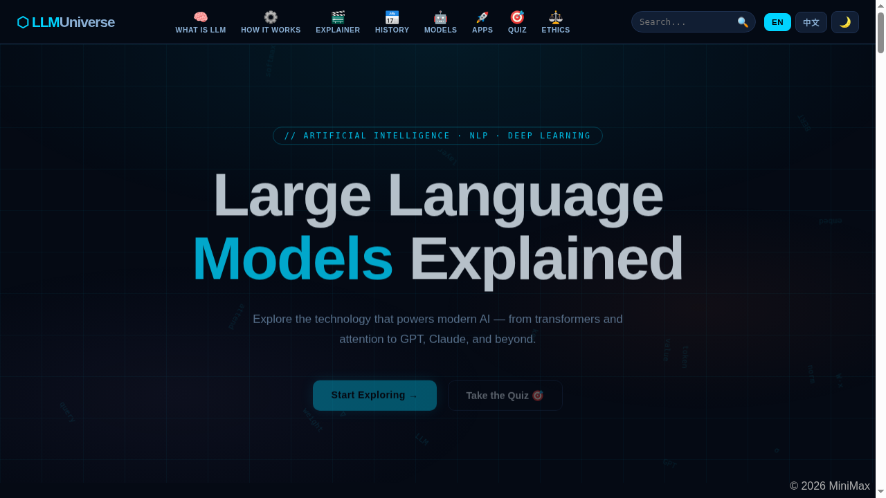

<p align="center">
  
</p>

<h1 align="center">Smart Water Lab</h1>

<p align="center">
  AI-Augmented Water Resources Decision Support Platform for rainfall monitoring,<br>
  hydrological runoff prediction, reservoir optimization, and flood-risk analysis.
</p>

<p align="center">
  <strong>Course Project Portfolio</strong> — AI-Augmented Software Engineering<br>
  Xi'an Jiaotong University · 2026 · Mahmudul Hasan (4125999049)
</p>

<p align="center">
  <a href="#project-snapshot">Snapshot</a> ·
  <a href="#platform-gallery">Gallery</a> ·
  <a href="#course-assignments">Assignments</a> ·
  <a href="#results-snapshot">Results</a> ·
  <a href="#quick-start">Quick Start</a> ·
  <a href="#documentation">Docs</a>
</p>

<p align="center">
  
  
  
  
  
  
  
</p>

---

## Why this project matters

Water managers must act under uncertainty — heavy rain, limited storage, and flood exposure at the same time. This portfolio integrates four hydrology modules into one Streamlit decision-support workflow, with documented AI-assisted engineering (prompt logs, Swiss Cheese testing, physical validation). Details: [docs/ENGINEERING.md](docs/ENGINEERING.md).

---

## Project snapshot

<a id="project-snapshot"></a>

| | |
|--|--|
| **33** automated tests in this repository (CI) | **96%** coverage on `src/` |
| **18** physical validation rules | **16** weekly lab reports |
| **4** engineering experiments | **5** formal PDF reports |

*Additional local experiment verification:* **88** supplementary pytest tests in development folders (not in this repo). See [docs/TEST_COUNTS.md](docs/TEST_COUNTS.md).

---

## Platform gallery

<a id="platform-gallery"></a>

| Rainfall dashboard | Runoff analysis |
|:--:|:--:|
|  |  |

| Reservoir optimization | Flood inundation |
|:--:|:--:|
|  |  |

---

## Course assignments

<a id="course-assignments"></a>

### Assignment 1 — LLM Universe Educational Website

**Topic:** Large Language Models, AI foundations, and prompt engineering  
**Built with:** [MiniMax Agent](https://www.minimaxi.com/) — interactive web application

<p align="center">
  <a href="https://d00r08r76qg9.space.minimaxi.com/">
    
  </a>
</p>

<p align="center">
  <strong><a href="https://d00r08r76qg9.space.minimaxi.com/">LLM Universe — Large Language Models Explained</a></strong><br>
  Also includes Weeks 1–2 lab work and AI-assisted development reflection · <a href="assignment1/">assignment1/</a>
</p>

---

### Assignment 2 — CNN-Based MNIST Digit Classification

PyTorch CNN — training, evaluation, confusion matrix, demo.  
➡️ [assignment2/](assignment2/)

---

### Assignment 3 — Swiss Cheese Testing & AI Failure Analysis

Layered pytest that caught AI-assisted hydrology mistakes (buggy vs corrected SCS-CN).  
➡️ [assignment3/](assignment3/)

---

### Assignment 4 — Smart Water Decision Support Capstone

Integrated Streamlit app, formal reports, live-demo materials.  
➡️ [assignment4/](assignment4/) · `streamlit run app/main.py`

| Folder | Contents |
|--------|----------|
| `assignment1/`–`assignment4/` | Course deliverables |
| `app/` · `src/` · `tests/` | Capstone dashboard + **33** pytest |
| `submission/` · `lab_reports/` · `docs/` | Reports, labs, engineering docs |

---

## Results snapshot

<a id="results-snapshot"></a>

| Experiment | Key result |
|------------|------------|
| Rainfall monitoring | GREEN / YELLOW / RED alerts; 3h/6h forecast pipeline |
| SCS-CN runoff | Q = **13.80 mm** verified at P = 50 mm, CN = 80 |
| Reservoir optimization | Monte Carlo **P10 / P50 / P90** (100 scenarios) |
| Flood inundation | **9/9** physical validation checks passed |

Reports: [submission/](submission/) · [Release v1.0](https://github.com/mahmud456alhasan-debug/smart-water-capstone/releases/tag/v1.0.0)

---

## Quick start

<a id="quick-start"></a>

```bash
git clone https://github.com/mahmud456alhasan-debug/smart-water-capstone.git
cd smart-water-capstone
python3 -m pip install -r requirements.txt
streamlit run app/main.py
pytest -q    # 33 passed
```

Copy `dem.npy` into `data/` for the flood tab.

---

## Documentation

<a id="documentation"></a>

| Resource | Purpose |
|----------|---------|
| [assignment1/](assignment1/) | LLM Universe (MiniMax) + Weeks 1–2 labs |
| [assignment2/](assignment2/) · [assignment3/](assignment3/) · [assignment4/](assignment4/) | Assignments 2–4 |
| [lab_reports/](lab_reports/) | 16 weekly lab reports (Weeks 1–8) |
| [submission/](submission/) | 5 formal PDF reports + LaTeX |
| [docs/README.md](docs/README.md) | Full documentation index |
| [docs/ENGINEERING.md](docs/ENGINEERING.md) | Validation & AI engineering evidence |
| [docs/PRESENTATION_OUTLINE.md](docs/PRESENTATION_OUTLINE.md) | 5-minute demo script |

---

## License

Academic coursework — Xi'an Jiaotong University, 2026.
