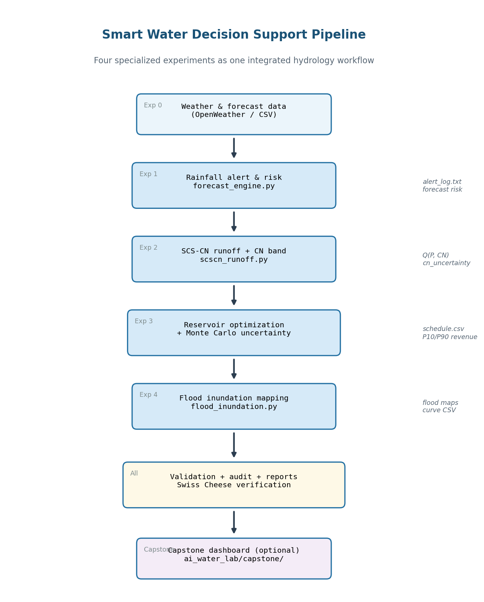
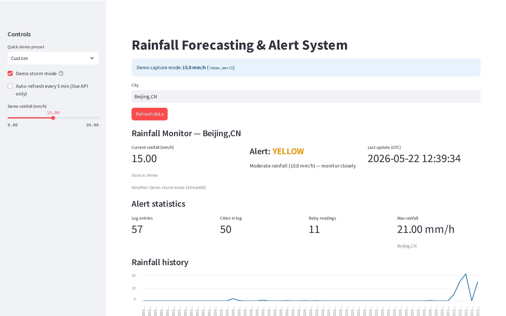
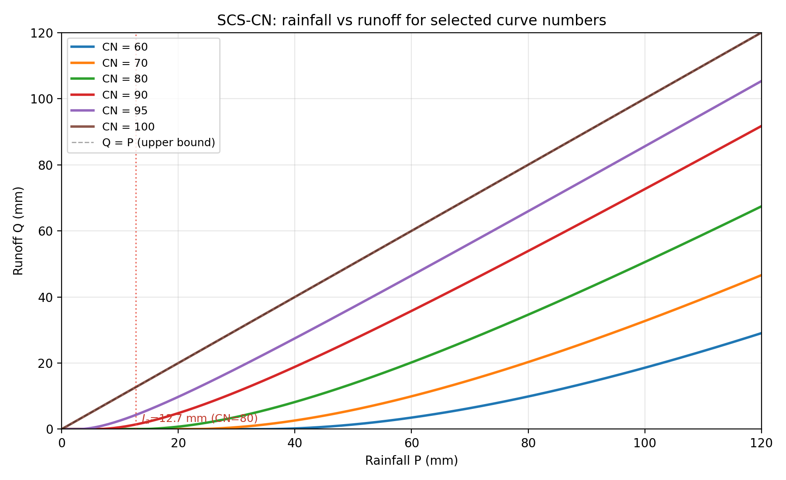
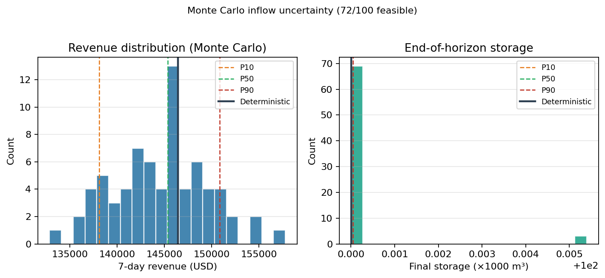
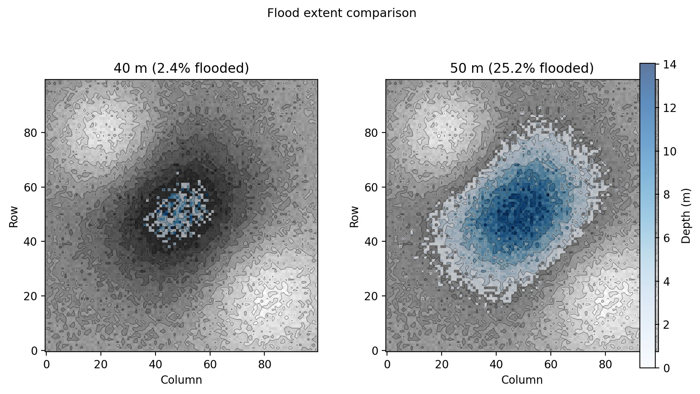
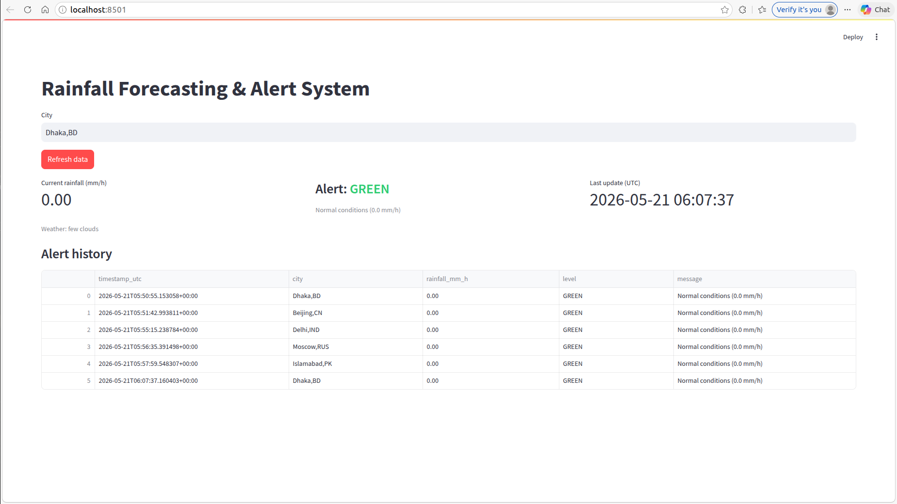
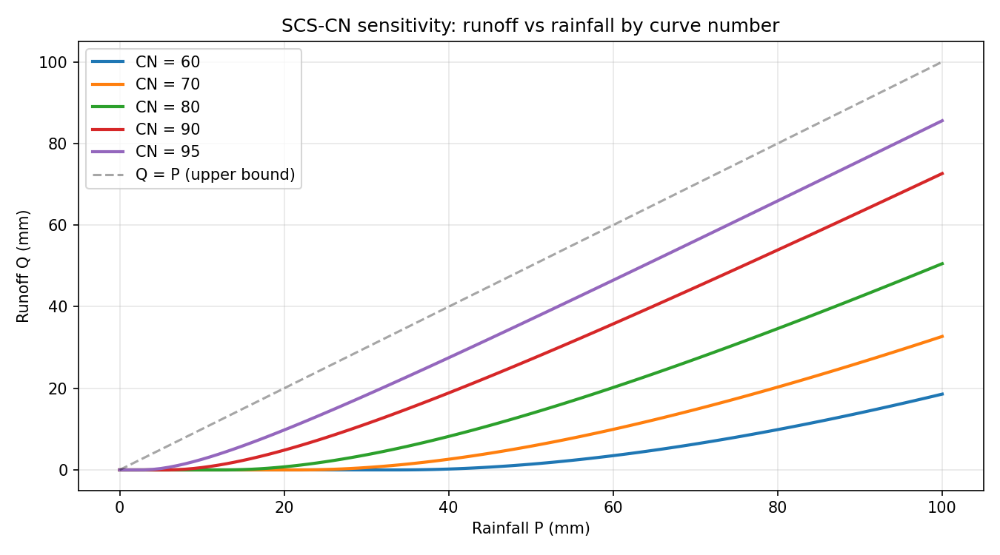
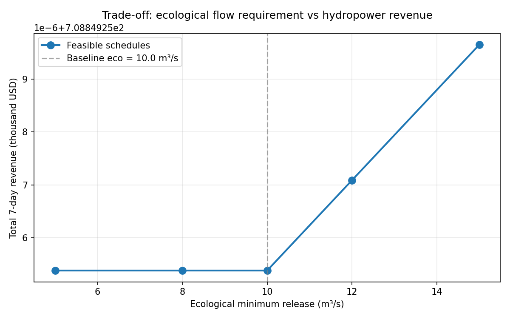
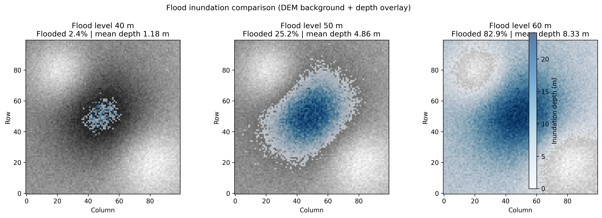

<p align="center">
  
</p>

<h1 align="center">Smart Water Lab</h1>

<p align="center">
  <strong>AI-Augmented Water Resources Decision Support Platform</strong><br>
  Rainfall Monitoring · Runoff Modeling · Reservoir Optimization · Flood Analysis
</p>

<p align="center">
  <strong>Course Project Portfolio</strong> — AI-Augmented Software Engineering<br>
  Xi'an Jiaotong University · 2026 · Mahmudul Hasan (4125999049)
</p>

<p align="center">
  <a href="#course-assignments">Assignments</a> ·
  <a href="#project-snapshot">Snapshot</a> ·
  <a href="#platform-gallery">Gallery</a> ·
  <a href="#results-snapshot">Results</a> ·
  <a href="#key-deliverables">Reports</a> ·
  <a href="#quick-start">Quick Start</a> ·
  <a href="#learning-journey-weeks-18">Labs</a> ·
  <a href="#further-documentation">Docs</a>
</p>

<p align="center">
  
  
  
  
  
  
  
  
</p>

---

## Why this project matters

Water managers must act under uncertainty — heavy rain, limited storage, and flood exposure at the same time. This portfolio integrates **rainfall monitoring**, **SCS-CN runoff prediction**, **reservoir operation planning**, and **flood-risk assessment** into one Streamlit decision-support workflow, with documented AI-assisted engineering practices (prompt logs, Swiss Cheese testing, physical validation).

---

## Project snapshot

| Metric | Value |
|--------|------:|
| Course assignments | **4** |
| Specialized experiments | **4** |
| Weekly lab reports | **16** |
| Formal PDF reports | **5** |
| Automated tests (this repository) | **33** |
| Additional experiment tests (local dev folders, not in repo) | **88** |
| Total verification tests | **121** |
| Validation CLI scripts | **4** |
| AI outputs reviewed / corrected | **52 / 9** |
| Monte Carlo inflow scenarios | **100** |

---

## Course assignments

<a id="course-assignments"></a>

### Assignment 1 — Reasoning Log and AI-Assisted Development Reflection

Weeks 1–2 laboratory reports, prompt logs, and LLM exploration activities.  
Includes an interactive LLM education site built as part of the reflection work.

➡️ [Open assignment1/](assignment1/) · [Live exploration site](https://d00r08r76qg9.space.minimaxi.com/)

---

### Assignment 2 — CNN-Based MNIST Digit Classification

PyTorch CNN for handwritten digit recognition — training, evaluation, confusion matrix, and demo.

➡️ [Open assignment2/](assignment2/)

---

### Assignment 3 — Swiss Cheese Testing and AI Failure Analysis

Layered pytest verification that caught AI-assisted hydrology mistakes — buggy vs corrected SCS-CN code, evidence chain, regression tests.

➡️ [Open assignment3/](assignment3/)

---

### Assignment 4 — Smart Water Decision Support Capstone

Integrated Streamlit app, engineering documentation, formal experiment reports, and live-demo materials.

➡️ [Open assignment4/](assignment4/) · [Run the app](app/main.py)

---

### Repository layout

| Folder | Contents |
|--------|----------|
| `assignment1/` | Reasoning log, Weeks 1–2 labs, LLM exploration link |
| `assignment2/` | CNN MNIST project + PDF report |
| `assignment3/` | Swiss Cheese testing + AI failure evidence |
| `assignment4/` | Capstone rubric and checklist |
| `app/` | Streamlit dashboard |
| `src/` | Core hydrology modules |
| `tests/` | Pytest suite (**33** tests in CI) |
| `submission/` | Final experiment reports (PDF + LaTeX) |
| `lab_reports/` | Weekly laboratory reports (Weeks 1–8) |
| `docs/` | Engineering documentation |

Also: [`assets/`](assets/) showcase figures · [`release/`](release/) GitHub Release PDFs

---

## Platform gallery

<a id="platform-gallery"></a>

| Rainfall monitoring | Runoff modeling |
|:--:|:--:|
|  |  |
| Exp 1 — API, GREEN/YELLOW/RED, 3h/6h forecast | Exp 2 — hand-validated Q=13.80 mm at P=50, CN=80 |

| Reservoir optimization | Flood analysis |
|:--:|:--:|
|  |  |
| Exp 3 — trust-constr, eco trade-off, P10/P50/P90 | Exp 4 — DEM inundation, 9/9 validation PASS |

---

## Results snapshot

<a id="results-snapshot"></a>

| Experiment | Key result |
|------------|------------|
| Rainfall monitoring | GREEN / YELLOW / RED classification validated; 3h/6h forecast risk pipeline |
| SCS-CN runoff | Reference Q = **13.80 mm** verified at P = 50 mm, CN = 80 |
| Reservoir optimization | Monte Carlo **P10 / P50 / P90** revenue and storage analysis (100 scenarios) |
| Flood inundation | **9/9** physical validation checks passed (monotonicity, bounds, DEM consistency) |

Full evidence: [submission/](submission/) · [docs/ENGINEERING.md](docs/ENGINEERING.md)

---

## Technologies

Python · Streamlit · NumPy · SciPy · Pytest · Monte Carlo simulation · SCS-CN hydrology · Cursor Agent · Chain-of-Thought prompting · Physical validation CLI

---

## Key deliverables

<a id="key-deliverables"></a>

| | Document | Download |
|--|----------|----------|
| 📘 | **AI Engineering Portfolio** — pipeline, AI statistics, threats to validity | [PDF](submission/portfolio/AI_Engineering_Portfolio.pdf) |
| 📄 | **Experiment 1** — Rainfall monitoring & alerting | [PDF](submission/experiment_reports/Experiment1_Rainfall_Alert/Experiment1_Rainfall_Alert_Report.pdf) |
| 📄 | **Experiment 2** — SCS-CN runoff modeling | [PDF](submission/experiment_reports/Experiment2_SCSCN_Runoff/Experiment2_SCSCN_Runoff_Report.pdf) |
| 📄 | **Experiment 3** — Reservoir dispatch optimization | [PDF](submission/experiment_reports/Experiment3_Reservoir_Optimization/Experiment3_Reservoir_Optimization_Report.pdf) |
| 📄 | **Experiment 4** — Flood inundation analysis | [PDF](submission/experiment_reports/Experiment4_Flood_Inundation/Experiment4_Flood_Inundation_Report.pdf) |

**Release bundle:** [v1.0 — Smart Water Lab Submission](https://github.com/mahmud456alhasan-debug/smart-water-capstone/releases/tag/v1.0.0) · PDFs in [`release/`](release/) · LaTeX in [`submission/`](submission/) · [Create release →](docs/GITHUB_SETUP.md#step-3--create-release-v10-5-minutes)

---

## Quick start

<a id="quick-start"></a>

```bash
git clone https://github.com/mahmud456alhasan-debug/smart-water-capstone.git
cd smart-water-capstone
python3 -m pip install -r requirements.txt
streamlit run app/main.py
pytest -q
```

Copy `dem.npy` into `data/` for the flood tab (from Week 6 lab or local Experiment 4 output).

---

## Learning journey (Weeks 1–8)

<a id="learning-journey-weeks-18"></a>

Complete semester progression from AI-assisted software engineering foundations to the integrated Smart Water platform.

| Stage | Topics |
|-------|--------|
| Weeks 1–2 | AI setup, Chain-of-Thought, AGENTS.md |
| Weeks 3–4 | Agile development, TDD, refactoring |
| Weeks 5–6 | Rainfall, runoff, reservoir, and flood labs |
| Weeks 7–8 | Capstone planning, implementation, testing, demo |

<p align="center">
  <a href="lab_reports/README.md">
    
    
    
    
  </a>
</p>

<p align="center">
  <strong>16 reports</strong> · 16 PDFs · LaTeX sources · appendix code<br><br>
  <a href="lab_reports/README.md"><strong>Explore the complete learning journey →</strong></a>
</p>

---

## Further documentation

<a id="further-documentation"></a>

| Resource | Purpose |
|----------|---------|
| [docs/README.md](docs/README.md) | **Documentation index** — all process and engineering docs |
| [submission/README.md](submission/README.md) | Formal experiment reports (PDF + LaTeX) |
| [assignment1/README.md](assignment1/README.md) | Assignment 1 — Reasoning Log |
| [assignment2/README.md](assignment2/README.md) | Assignment 2 — CNN MNIST + PDF |
| [assignment3/README.md](assignment3/README.md) | Assignment 3 — Swiss Cheese test suite |
| [assignment4/README.md](assignment4/README.md) | Assignment 4 — capstone rubric |
| [lab_reports/README.md](lab_reports/README.md) | Weekly lab reports (Weeks 1–8) |
| [docs/ENGINEERING.md](docs/ENGINEERING.md) | Validation and AI engineering evidence |
| [docs/GITHUB_SETUP.md](docs/GITHUB_SETUP.md) | About section, Release v1.0, wiki |

---

## License

Academic coursework — Xi'an Jiaotong University, 2026.
