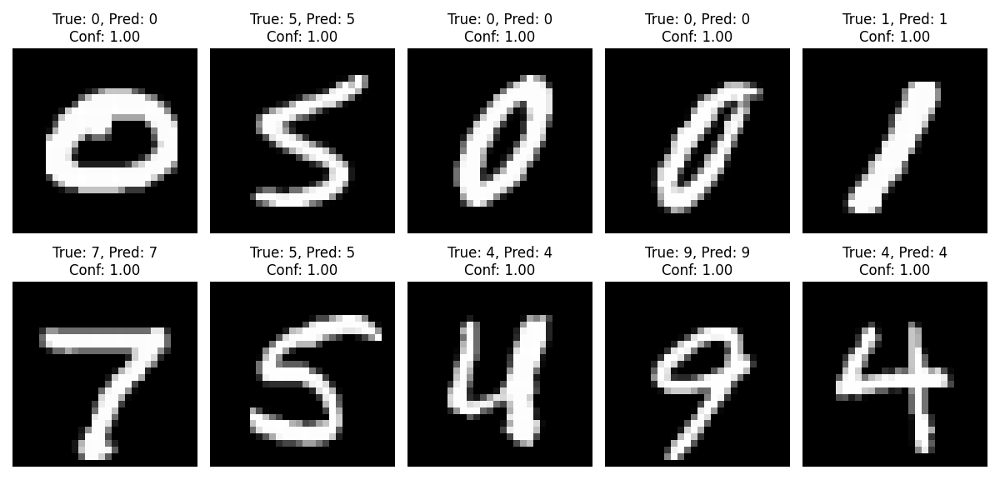
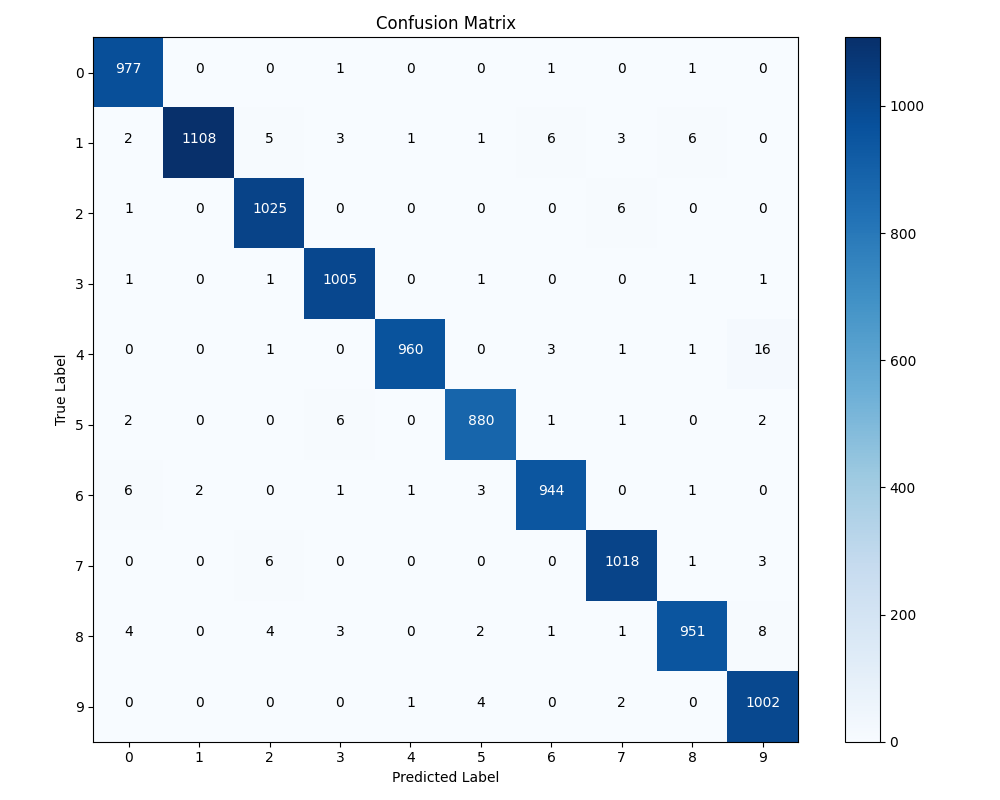

# Assignment 2 — Legacy Code Modernization / CNN MNIST

**Mahmudul Hasan (4125999049)** · Xi'an Jiaotong University · 2026  
**Course:** AI-Augmented Software Engineering · **Weight:** 20% · **Due:** Week 8

---

## Deliverables

| File | Description |
|------|-------------|
| [MAHMUDUL_HASAN_4125999049_Assignment_2.pdf](MAHMUDUL_HASAN_4125999049_Assignment_2.pdf) | Full assignment report (PDF) |
| [cnn_mnist/](cnn_mnist/) | Modernized CNN for MNIST digit classification |

---

## Project: CNN for MNIST

PyTorch CNN (`DigitCNN`) for handwritten digit recognition — training, evaluation, confusion matrix, and demo predictions.

<p align="center">
  
  
</p>

### Code

| File | Purpose |
|------|---------|
| [cnn_mnist/model.py](cnn_mnist/model.py) | `DigitCNN` architecture |
| [cnn_mnist/mnist_cnn.py](cnn_mnist/mnist_cnn.py) | Train, test, demo CLI |
| [cnn_mnist/mnist_cnn_model.pth](cnn_mnist/mnist_cnn_model.pth) | Pre-trained weights (~812 KB) |
| [cnn_mnist/requirements.txt](cnn_mnist/requirements.txt) | Dependencies |

---

## Quick start

```bash
cd assignment2/cnn_mnist
python3 -m pip install -r requirements.txt

# Demo with pre-trained weights (downloads MNIST if needed)
python3 mnist_cnn.py --mode demo

# Train from scratch (optional)
python3 mnist_cnn.py --mode train

# Evaluate + confusion matrix
python3 mnist_cnn.py --mode eval
```

**Note:** MNIST data (~65 MB) is **not** stored in git. PyTorch downloads it automatically to `cnn_mnist/data/MNIST/` on first run.

---

## Related course work

| Assignment | Folder |
|------------|--------|
| Assignment 1 — Reasoning Log | [lab_reports/](../lab_reports/) (Weeks 1–2) |
| Assignment 2 | **this folder** |
| Assignment 3 — Swiss Cheese Test Suite | [assignment3/](../assignment3/) |
| Assignment 4 — Final Capstone | [assignment4/](../assignment4/) + [app/](../app/) |

---

## Related

| Resource | Link |
|----------|------|
| Main repository | [README](../README.md) |
| Weekly labs (Week 4 refactoring) | [lab_reports/Week4_SessionA_Report.pdf](../lab_reports/Week4_SessionA_Report.pdf) |
