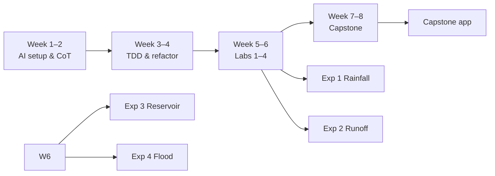

# Weekly Lab Reports

**Mahmudul Hasan (4125999049)** · Xi'an Jiaotong University · 2026

Course weekly lab reports (Weeks 1–8): LaTeX sources, compiled PDFs, appendix code, and prompt logs. These document the progression toward the four specialized experiments and capstone.

[← Back to main repository](../README.md)


---

## Lab highlights

<p align="center">
  
  
  
  
</p>

---

## Overview

| Weeks | Focus |
|-------|--------|
| 1–2 | AI setup, Chain-of-Thought, AGENTS.md |
| 3–4 | Agile scaffolding, TDD, refactoring |
| 5–6 | Specialized labs → Experiments 1–4 foundations |
| 7–8 | Capstone planning, development, testing, demo |

**Total:** 16 sessions · 16 PDF reports · 12 appendix `*_files/` folders (44 Python files, 57 screenshots)



---

## Report snapshots

<details open>
<summary><strong>Weeks 1–2 — AI foundations</strong></summary>
<br>

<p align="center">
  
  
  
</p>

| Session | Topic | Report |
|---------|-------|--------|
| 1A | Environment setup & first AI script | [PDF](Week1_SessionA_Report.pdf) · [TeX](Week1_SessionA_Report.tex) |
| 1B | AI mental models (Chain-of-Thought) | [PDF](Week1_SessionB_Report.pdf) · [TeX](Week1_SessionB_Report.tex) |
| 2A | Chain-of-Thought prompting | [PDF](Week2_SessionA_Report.pdf) · [TeX](Week2_SessionA_Report.tex) |
| 2B | Context engineering (AGENTS.md) | [PDF](Week2_SessionB_Report.pdf) · [TeX](Week2_SessionB_Report.tex) |

</details>

<details>
<summary><strong>Weeks 3–4 — Software engineering practice</strong></summary>
<br>

<p align="center">
  
  
  
</p>

| Session | Topic | Report |
|---------|-------|--------|
| 3A | Agile scaffolding practice | [PDF](Week3_SessionA_Report.pdf) · [TeX](Week3_SessionA_Report.tex) |
| 3B | Test-driven development | [PDF](Week3_SessionB_Report.pdf) · [TeX](Week3_SessionB_Report.tex) |
| 4A | Refactoring & migration | [PDF](Week4_SessionA_Report.pdf) · [TeX](Week4_SessionA_Report.tex) |
| 4B | Integration & flow practice | [PDF](Week4_SessionB_Report.pdf) · [TeX](Week4_SessionB_Report.tex) |

Appendix: [week3_session_a_files/](week3_session_a_files/) · [week3_session_b_files/](week3_session_b_files/) · [week4_session_a_files/](week4_session_a_files/) · [week4_session_b_files/](week4_session_b_files/)

</details>

<details open>
<summary><strong>Weeks 5–6 — Specialized labs (Experiments 1–4)</strong></summary>
<br>

<p align="center">
  
  
  
  
</p>

| Week | Session | Topic | → Experiment | Report |
|:----:|:-------:|-------|:------------:|--------|
| 5 | A | **Lab 1** — Rainfall alert | Exp 1 | [PDF](Week5_SessionA_Lab1_Report.pdf) · [TeX](Week5_SessionA_Lab1_Report.tex) |
| 5 | B | **Lab 2** — SCS-CN runoff | Exp 2 | [PDF](Week5_SessionB_Lab2_Report.pdf) · [TeX](Week5_SessionB_Lab2_Report.tex) |
| 6 | A | **Lab 3** — Reservoir optimization | Exp 3 | [PDF](Week6_SessionA_Lab3_Report.pdf) · [TeX](Week6_SessionA_Lab3_Report.tex) |
| 6 | B | **Lab 4** — Flood inundation | Exp 4 | [PDF](Week6_SessionB_Lab4_Report.pdf) · [TeX](Week6_SessionB_Lab4_Report.tex) |

Appendix: [week5_session_a_lab1_files/](week5_session_a_lab1_files/) · [week5_session_b_lab2_files/](week5_session_b_lab2_files/) · [week6_session_a_lab3_files/](week6_session_a_lab3_files/) · [week6_session_b_lab4_files/](week6_session_b_lab4_files/)

</details>

<details>
<summary><strong>Weeks 7–8 — Capstone & demo</strong></summary>
<br>

<p align="center">
  
  
  
</p>

| Session | Topic | Report |
|---------|-------|--------|
| 7A | Capstone project planning | [PDF](Week7_SessionA_Report.pdf) · [TeX](Week7_SessionA_Report.tex) |
| 7B | Capstone core development | [PDF](Week7_SessionB_Report.pdf) · [TeX](Week7_SessionB_Report.tex) |
| 8A | Testing & validation | [PDF](Week8_SessionA_Report.pdf) · [TeX](Week8_SessionA_Report.tex) |
| 8B | Final demo & defense preparation | [PDF](Week8_SessionB_Report.pdf) · [TeX](Week8_SessionB_Report.tex) |

Appendix: [week7_session_a_files/](week7_session_a_files/) · [week7_session_b_files/](week7_session_b_files/) · [week8_session_a_files/](week8_session_a_files/) · [week8_session_b_files/](week8_session_b_files/)

</details>

---

## Full report index

| Wk | Ses | Topic | PDF | LaTeX |
|:--:|:---:|:------|:---:|:-----:|
| 1 | A | Environment setup & first AI script | [PDF](Week1_SessionA_Report.pdf) | [TeX](Week1_SessionA_Report.tex) |
| 1 | B | AI mental models (Chain-of-Thought) | [PDF](Week1_SessionB_Report.pdf) | [TeX](Week1_SessionB_Report.tex) |
| 2 | A | Chain-of-Thought prompting | [PDF](Week2_SessionA_Report.pdf) | [TeX](Week2_SessionA_Report.tex) |
| 2 | B | Context engineering (AGENTS.md) | [PDF](Week2_SessionB_Report.pdf) | [TeX](Week2_SessionB_Report.tex) |
| 3 | A | Agile scaffolding practice | [PDF](Week3_SessionA_Report.pdf) | [TeX](Week3_SessionA_Report.tex) |
| 3 | B | Test-driven development | [PDF](Week3_SessionB_Report.pdf) | [TeX](Week3_SessionB_Report.tex) |
| 4 | A | Refactoring & migration | [PDF](Week4_SessionA_Report.pdf) | [TeX](Week4_SessionA_Report.tex) |
| 4 | B | Integration & flow practice | [PDF](Week4_SessionB_Report.pdf) | [TeX](Week4_SessionB_Report.tex) |
| 5 | A | **Lab 1** — Rainfall alert | [PDF](Week5_SessionA_Lab1_Report.pdf) | [TeX](Week5_SessionA_Lab1_Report.tex) |
| 5 | B | **Lab 2** — SCS-CN runoff | [PDF](Week5_SessionB_Lab2_Report.pdf) | [TeX](Week5_SessionB_Lab2_Report.tex) |
| 6 | A | **Lab 3** — Reservoir optimization | [PDF](Week6_SessionA_Lab3_Report.pdf) | [TeX](Week6_SessionA_Lab3_Report.tex) |
| 6 | B | **Lab 4** — Flood inundation | [PDF](Week6_SessionB_Lab4_Report.pdf) | [TeX](Week6_SessionB_Lab4_Report.tex) |
| 7 | A | Capstone project planning | [PDF](Week7_SessionA_Report.pdf) | [TeX](Week7_SessionA_Report.tex) |
| 7 | B | Capstone core development | [PDF](Week7_SessionB_Report.pdf) | [TeX](Week7_SessionB_Report.tex) |
| 8 | A | Testing & validation | [PDF](Week8_SessionA_Report.pdf) | [TeX](Week8_SessionA_Report.tex) |
| 8 | B | Final demo & defense preparation | [PDF](Week8_SessionB_Report.pdf) | [TeX](Week8_SessionB_Report.tex) |

---

## Path to specialized experiments

```text
Week 5 Lab 1  ──►  Experiment 1 (Rainfall alert)
Week 5 Lab 2  ──►  Experiment 2 (SCS-CN runoff)
Week 6 Lab 3  ──►  Experiment 3 (Reservoir optimization)
Week 6 Lab 4  ──►  Experiment 4 (Flood inundation)
Week 7–8      ──►  Capstone dashboard (app/, src/, tests/)
```

Formal experiment reports: [submission/](../submission/)

---

## Regenerate PDFs

```bash
pdflatex Week5_SessionA_Lab1_Report.tex && pdflatex Week5_SessionA_Lab1_Report.tex
# repeat for each Week*_Report.tex; run twice for references
```

Some reports require PNG screenshots in the same folder — see comments at the top of each `.tex` file.

---

## Related

| Resource | Link |
|----------|------|
| Main repository | [README](../README.md) |
| Specialized experiments | [submission/](../submission/) |
| Engineering validation | [docs/ENGINEERING.md](../docs/ENGINEERING.md) |
