<div align="center">

# 📚 Weekly Lab Reports — Smart Water Lab

**Mahmudul Hasan (4125999049)** · Xi'an Jiaotong University · 2026

*Course lab progression — from first AI script to capstone demo*

[](#-report-index)
[](#-report-index)
[](#-appendix-code-folders)
[](../README.md)

</div>

---

## 🖼️ Lab highlights

<p align="center">
  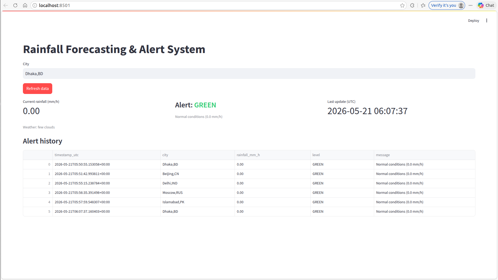
  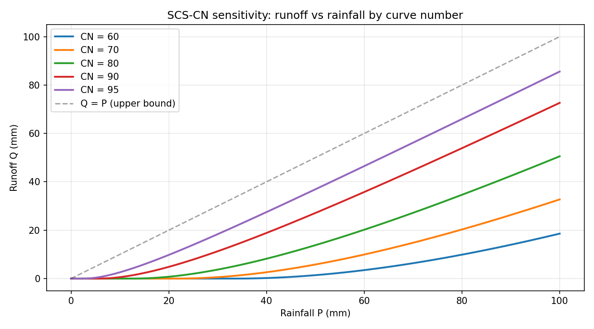
  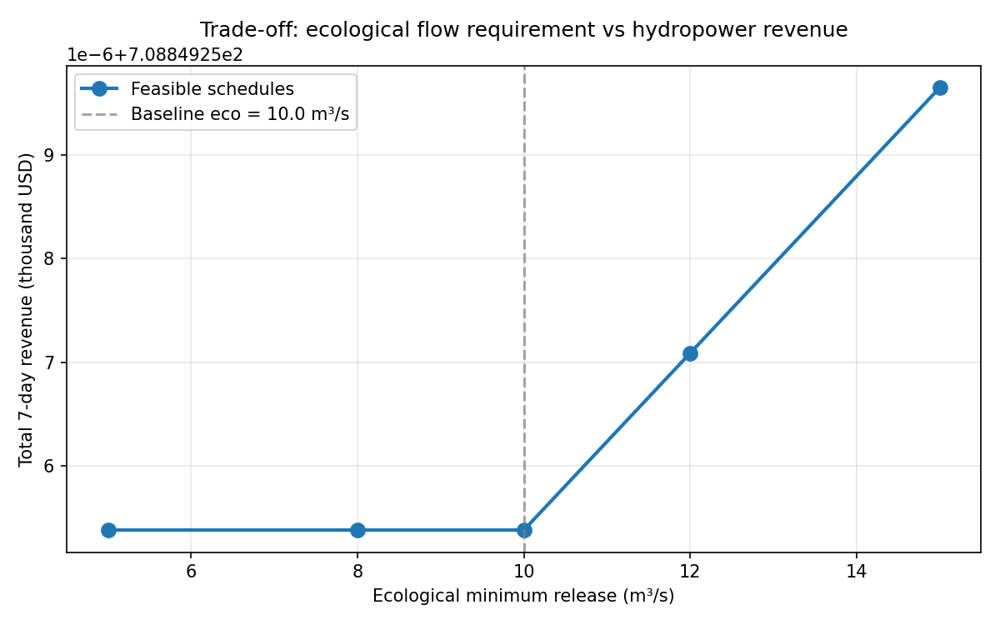
  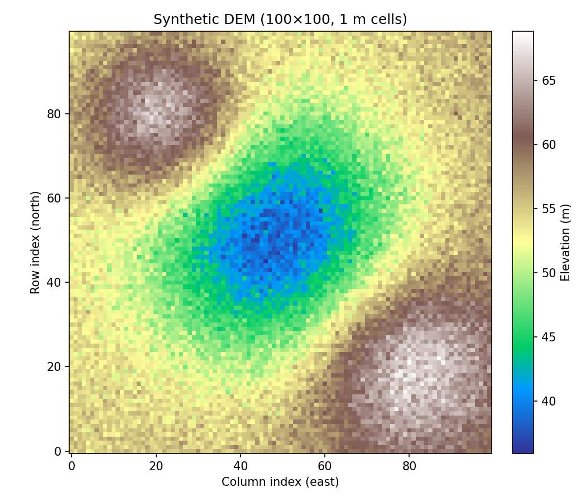
</p>

<p align="center">
  <em>🌧️ Rainfall alerts · 💧 Runoff modeling · ⚖️ Reservoir dispatch · 🌊 Flood mapping</em>
</p>

---

## 📊 At a glance

| | |
|:--|:--|
| 📅 **Duration** | Weeks 1–8 (16 sessions) |
| 📄 **Deliverables** | 16 LaTeX reports + 16 compiled PDFs |
| 🐍 **Appendix code** | 44 Python files · 57 screenshots · prompt logs |
| 🎯 **Outcome** | Foundations for 4 specialized experiments + capstone |

---

## 🗺️ Learning journey

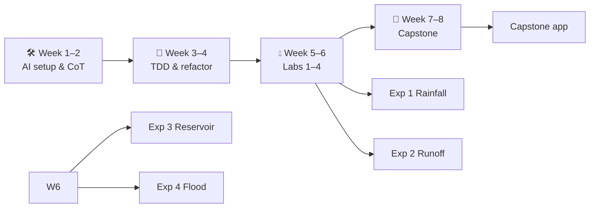

| Phase | Weeks | Focus | Emoji |
|-------|:-----:|-------|:-----:|
| **Foundation** | 1–2 | Environment setup, Chain-of-Thought, AGENTS.md | 🧠 |
| **Engineering** | 3–4 | Agile scaffolding, TDD, refactoring, integration | ⚙️ |
| **Specialized labs** | 5–6 | Labs 1–4 → Experiments 1–4 | 💧 |
| **Capstone** | 7–8 | Planning, development, testing, demo & defense | 🏁 |

---

## 📸 Report snapshots

<details open>
<summary><strong>🛠️ Weeks 1–2 — AI foundations</strong></summary>
<br>

<p align="center">
  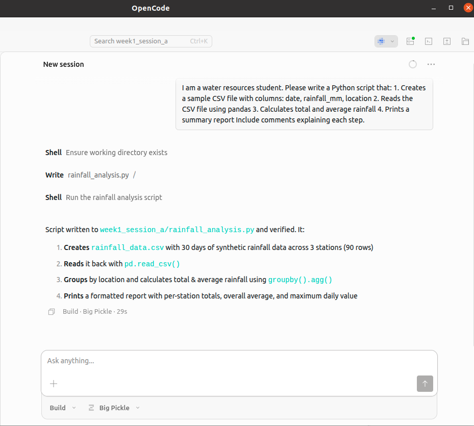
  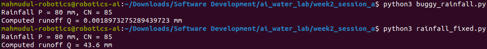
  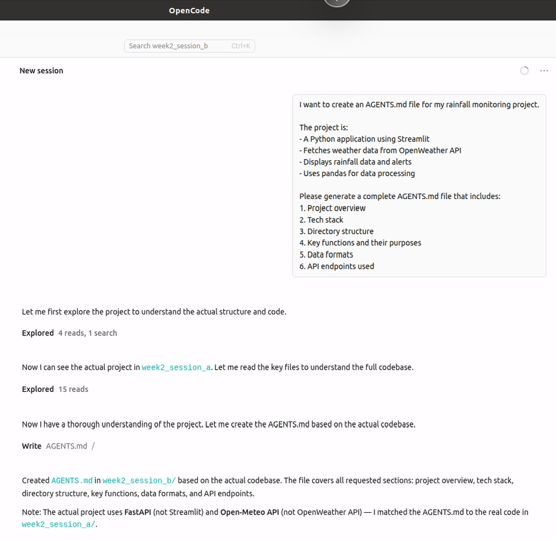
</p>

| Session | Topic | Open report |
|---------|-------|-------------|
| 1A | Environment setup & first AI script | [📄 PDF](Week1_SessionA_Report.pdf) · [📝 TeX](Week1_SessionA_Report.tex) |
| 1B | AI mental models (Chain-of-Thought) | [📄 PDF](Week1_SessionB_Report.pdf) · [📝 TeX](Week1_SessionB_Report.tex) |
| 2A | Chain-of-Thought prompting | [📄 PDF](Week2_SessionA_Report.pdf) · [📝 TeX](Week2_SessionA_Report.tex) |
| 2B | Context engineering (AGENTS.md) | [📄 PDF](Week2_SessionB_Report.pdf) · [📝 TeX](Week2_SessionB_Report.tex) |

</details>

<details>
<summary><strong>⚙️ Weeks 3–4 — Software engineering practice</strong></summary>
<br>

<p align="center">
  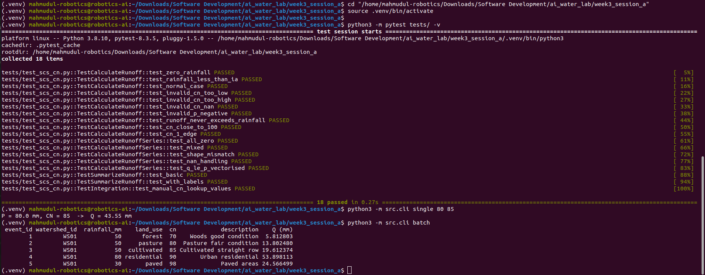
  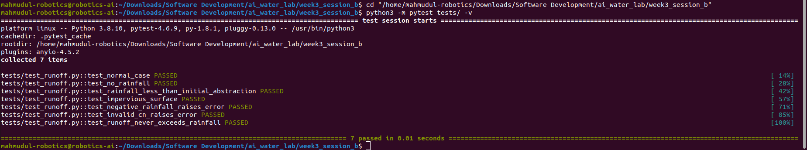
  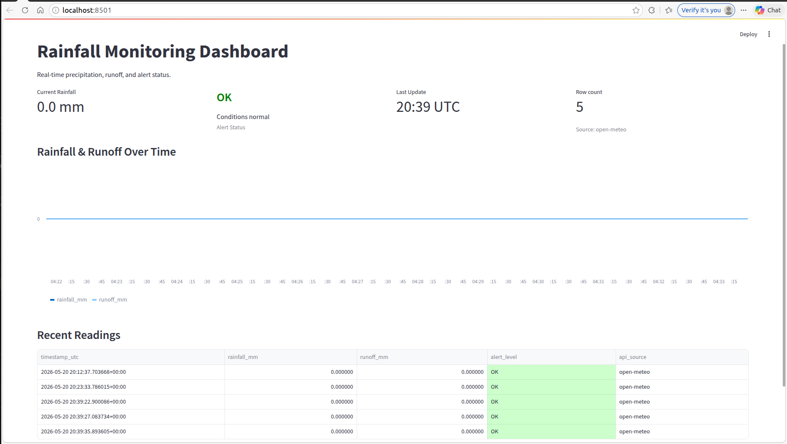
</p>

| Session | Topic | Open report |
|---------|-------|-------------|
| 3A | Agile scaffolding practice | [📄 PDF](Week3_SessionA_Report.pdf) · [📝 TeX](Week3_SessionA_Report.tex) |
| 3B | Test-driven development | [📄 PDF](Week3_SessionB_Report.pdf) · [📝 TeX](Week3_SessionB_Report.tex) |
| 4A | Refactoring & migration | [📄 PDF](Week4_SessionA_Report.pdf) · [📝 TeX](Week4_SessionA_Report.tex) |
| 4B | Integration & flow practice | [📄 PDF](Week4_SessionB_Report.pdf) · [📝 TeX](Week4_SessionB_Report.tex) |

📁 Code: [week3_session_a_files/](week3_session_a_files/) · [week3_session_b_files/](week3_session_b_files/) · [week4_session_a_files/](week4_session_a_files/) · [week4_session_b_files/](week4_session_b_files/)

</details>

<details open>
<summary><strong>💧 Weeks 5–6 — Specialized labs (Experiments 1–4)</strong></summary>
<br>

<p align="center">
  
  
  
  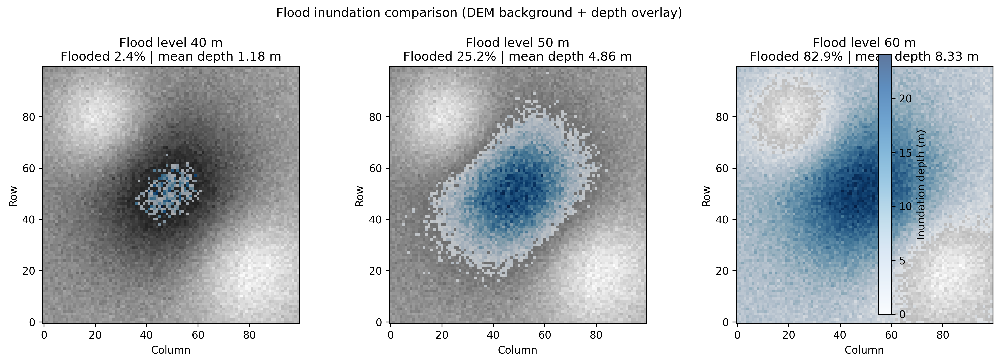
</p>

| Week | Session | Topic | → Experiment | Report |
|:----:|:-------:|-------|:------------:|--------|
| 5 | A | **Lab 1** — Rainfall alert | Exp 1 🌧️ | [📄 PDF](Week5_SessionA_Lab1_Report.pdf) · [📝 TeX](Week5_SessionA_Lab1_Report.tex) |
| 5 | B | **Lab 2** — SCS-CN runoff | Exp 2 💧 | [📄 PDF](Week5_SessionB_Lab2_Report.pdf) · [📝 TeX](Week5_SessionB_Lab2_Report.tex) |
| 6 | A | **Lab 3** — Reservoir optimization | Exp 3 ⚖️ | [📄 PDF](Week6_SessionA_Lab3_Report.pdf) · [📝 TeX](Week6_SessionA_Lab3_Report.tex) |
| 6 | B | **Lab 4** — Flood inundation | Exp 4 🌊 | [📄 PDF](Week6_SessionB_Lab4_Report.pdf) · [📝 TeX](Week6_SessionB_Lab4_Report.tex) |

📁 Code & figures: [week5_session_a_lab1_files/](week5_session_a_lab1_files/) · [week5_session_b_lab2_files/](week5_session_b_lab2_files/) · [week6_session_a_lab3_files/](week6_session_a_lab3_files/) · [week6_session_b_lab4_files/](week6_session_b_lab4_files/)

</details>

<details>
<summary><strong>🚀 Weeks 7–8 — Capstone & demo</strong></summary>
<br>

<p align="center">
  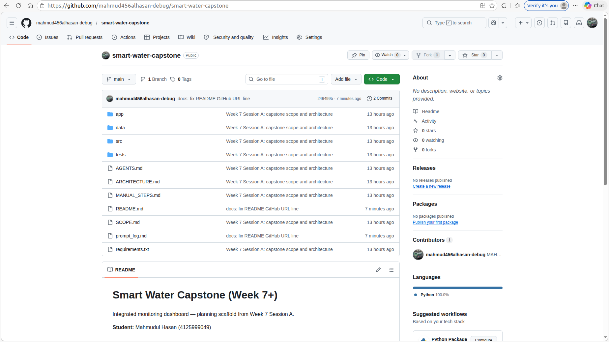
  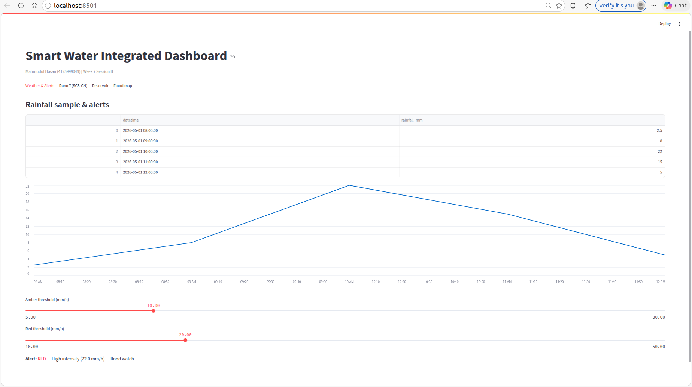
  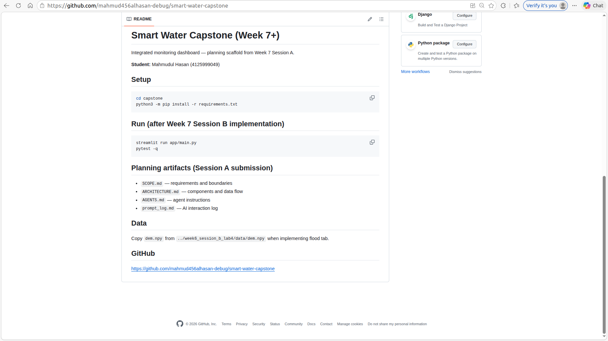
</p>

| Session | Topic | Open report |
|---------|-------|-------------|
| 7A | Capstone project planning | [📄 PDF](Week7_SessionA_Report.pdf) · [📝 TeX](Week7_SessionA_Report.tex) |
| 7B | Capstone core development | [📄 PDF](Week7_SessionB_Report.pdf) · [📝 TeX](Week7_SessionB_Report.tex) |
| 8A | Testing & validation | [📄 PDF](Week8_SessionA_Report.pdf) · [📝 TeX](Week8_SessionA_Report.tex) |
| 8B | Final demo & defense preparation | [📄 PDF](Week8_SessionB_Report.pdf) · [📝 TeX](Week8_SessionB_Report.tex) |

📁 Artifacts: [week7_session_a_files/](week7_session_a_files/) · [week7_session_b_files/](week7_session_b_files/) · [week8_session_a_files/](week8_session_a_files/) · [week8_session_b_files/](week8_session_b_files/)

</details>

---

## 📋 Report index

| Wk | Ses | Topic | PDF | LaTeX |
|:--:|:---:|:------|:---:|:-----:|
| 1 | A | Environment setup & first AI script | [📄](Week1_SessionA_Report.pdf) | [📝](Week1_SessionA_Report.tex) |
| 1 | B | AI mental models (Chain-of-Thought) | [📄](Week1_SessionB_Report.pdf) | [📝](Week1_SessionB_Report.tex) |
| 2 | A | Chain-of-Thought prompting | [📄](Week2_SessionA_Report.pdf) | [📝](Week2_SessionA_Report.tex) |
| 2 | B | Context engineering (AGENTS.md) | [📄](Week2_SessionB_Report.pdf) | [📝](Week2_SessionB_Report.tex) |
| 3 | A | Agile scaffolding practice | [📄](Week3_SessionA_Report.pdf) | [📝](Week3_SessionA_Report.tex) |
| 3 | B | Test-driven development | [📄](Week3_SessionB_Report.pdf) | [📝](Week3_SessionB_Report.tex) |
| 4 | A | Refactoring & migration | [📄](Week4_SessionA_Report.pdf) | [📝](Week4_SessionA_Report.tex) |
| 4 | B | Integration & flow practice | [📄](Week4_SessionB_Report.pdf) | [📝](Week4_SessionB_Report.tex) |
| 5 | A | **Lab 1** — Rainfall alert | [📄](Week5_SessionA_Lab1_Report.pdf) | [📝](Week5_SessionA_Lab1_Report.tex) |
| 5 | B | **Lab 2** — SCS-CN runoff | [📄](Week5_SessionB_Lab2_Report.pdf) | [📝](Week5_SessionB_Lab2_Report.tex) |
| 6 | A | **Lab 3** — Reservoir optimization | [📄](Week6_SessionA_Lab3_Report.pdf) | [📝](Week6_SessionA_Lab3_Report.tex) |
| 6 | B | **Lab 4** — Flood inundation | [📄](Week6_SessionB_Lab4_Report.pdf) | [📝](Week6_SessionB_Lab4_Report.tex) |
| 7 | A | Capstone project planning | [📄](Week7_SessionA_Report.pdf) | [📝](Week7_SessionA_Report.tex) |
| 7 | B | Capstone core development | [📄](Week7_SessionB_Report.pdf) | [📝](Week7_SessionB_Report.tex) |
| 8 | A | Testing & validation | [📄](Week8_SessionA_Report.pdf) | [📝](Week8_SessionA_Report.tex) |
| 8 | B | Final demo & defense preparation | [📄](Week8_SessionB_Report.pdf) | [📝](Week8_SessionB_Report.tex) |

---

## 📁 Appendix code folders

| Folder | Lab | Contents |
|--------|-----|----------|
| [week3_session_a_files/](week3_session_a_files/) | Week 3A | `src/`, `tests/`, prompt logs |
| [week3_session_b_files/](week3_session_b_files/) | Week 3B | TDD green/red/refactor prompts |
| [week4_session_a_files/](week4_session_a_files/) | Week 4A | Legacy vs modern hydrology |
| [week4_session_b_files/](week4_session_b_files/) | Week 4B | Alert system integration |
| [week5_session_a_lab1_files/](week5_session_a_lab1_files/) | Week 5 Lab 1 | Rainfall lab data & code |
| [week5_session_b_lab2_files/](week5_session_b_lab2_files/) | Week 5 Lab 2 | Runoff figures & sensitivity |
| [week6_session_a_lab3_files/](week6_session_a_lab3_files/) | Week 6 Lab 3 | Trade-off plots |
| [week6_session_b_lab4_files/](week6_session_b_lab4_files/) | Week 6 Lab 4 | DEM & flood comparison figures |
| [week7_session_a_files/](week7_session_a_files/) | Week 7A | Capstone planning docs |
| [week7_session_b_files/](week7_session_b_files/) | Week 7B | Development artifacts |
| [week8_session_a_files/](week8_session_a_files/) | Week 8A | Test & validation logs |
| [week8_session_b_files/](week8_session_b_files/) | Week 8B | Demo & GitHub screenshots |

Runnable capstone code: [`../app/`](../app/) · [`../src/`](../src/) · [`../tests/`](../tests/)

---

## 🔗 Path to specialized experiments

```
Week 5 Lab 1  ──►  🌧️ Experiment 1 (Rainfall alert)
Week 5 Lab 2  ──►  💧 Experiment 2 (SCS-CN runoff)
Week 6 Lab 3  ──►  ⚖️ Experiment 3 (Reservoir optimization)
Week 6 Lab 4  ──►  🌊 Experiment 4 (Flood inundation)
Week 7–8      ──►  🚀 Capstone dashboard (app/, src/, tests/)
```

Formal experiment PDFs: **[submission/](../submission/)** · Case study: **[submission/portfolio/](../submission/portfolio/)**

---

## 🔄 Regenerate PDFs

From this folder (`lab_reports/`):

```bash
pdflatex Week5_SessionA_Lab1_Report.tex && pdflatex Week5_SessionA_Lab1_Report.tex
# repeat for each Week*_Report.tex; run twice for references
```

Some reports need PNG screenshots in the same folder — see comments at the top of each `.tex` file.

---

## 🔗 Related

| Resource | Link |
|----------|------|
| 🏠 Main repository | [README](../README.md) |
| 📦 Specialized experiments (PDF + LaTeX) | [submission/](../submission/) |
| 📊 AI engineering case study | [submission/portfolio/](../submission/portfolio/) |
| 🧪 Capstone tests (88) | [tests/](../tests/) |

---

<div align="center">

**16 labs · 8 weeks · 1 integrated smart water pipeline**

[⬆ Back to top](#-weekly-lab-reports--smart-water-lab) · [🏠 Main repo](../README.md)

</div>
